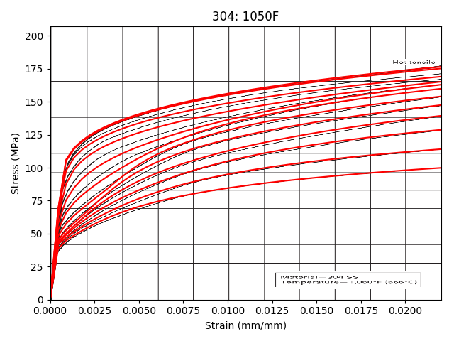
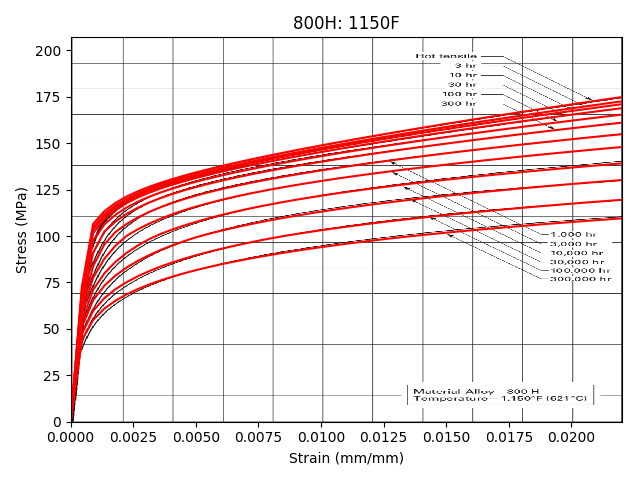
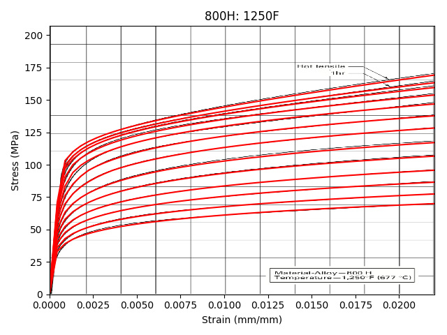
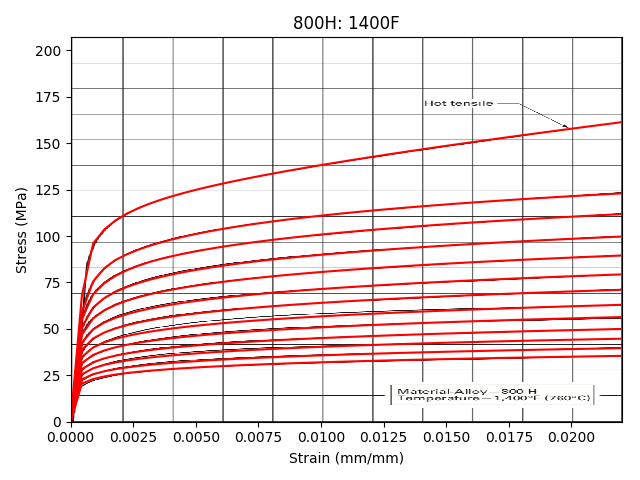
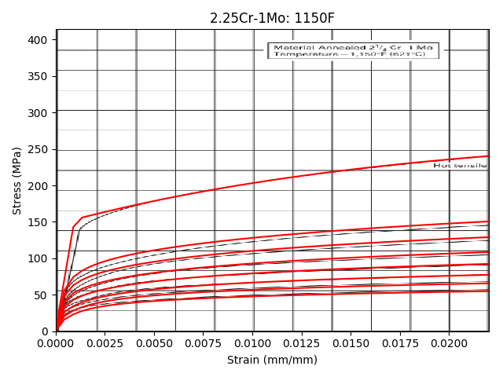
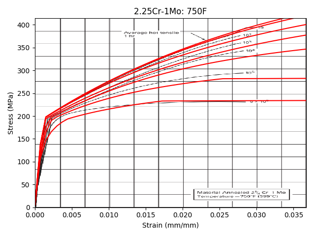
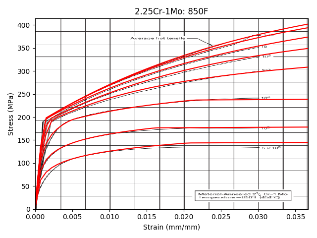

.. _validation:

Verification and Validation
===========================

Verification is the process of ensuring the software package meets the system requirements.  Validation is ultimate acceptance by the end user.  For the hbbdata package verification testing is accomplished through a two step approach:

1. For digitization of Code table or figure data, one developer impalements the digitization while a second developer peer-reviews the work by checking each entry against the corresponding table in the Code.
2. A unit test suite:

   1. Spot checks individual, interpolated values against randomly selected corresponding checks to the relevant Code book.
   2. Ensure that the appropriate out of bounds exceptions are thrown if the user requests data at conditions outside those allowed by the Code.

As this is a data package, our expectation is that the end user requirements are essentially accurate results, as checked with the verification procedure.  As such, this part of the documentation focuses on the verification process.  End user feedback on the API and python interface will be incorporated into the final, release version of the software.

Verification cross-checks
-------------------------

The tabulated Code data was entered into a digital format in the ``data/`` directory.  The format used for 1D and 2D tables is such that the digitized versions of the table correspond, as much as possible, the actual Code book tables.  This simplifies the process of cross-checking results.  Each individual table was entered by the developer working on the related feature fulfilling a requirement in :ref:`requirements`.  A second, independent developer then cross-checked the table entry manually against the Code.  This peer review process was documented in comments directly in the tables in ``data/``.

Unit testing
------------

As an additional layer of verification testing, the package contains python unit tests in the ``test/`` directory, which can be automatically run with the `nose <https://pypi.org/project/nose/>`_ test harness.  These unit tests do spot checks on the accuracy of the design data and also check to make sure the package will not return design data for invalid input parameters.  As described in the :ref:`installation` section, these tests should be run by the user after installing the package to validate the integrity of the installation.

Isochronous curves
------------------

The isochronous stress-strain curves are the exception to this validation plan.  As noted in the :ref:`plan` the strategy for implementing the isochronous stress-strain curves is *not* to digitize the Section III, Division 5 plots, but rather to implement the original deformation models underlying the plotted curves.  This ensure that values can be easily calculated for arbitrary values of stress, time, and temperature.  However, the process of uncovering and implementing the underlying models uncovered several small discrepancies between the current Division 5 isochronous curves and the original models.  The following figures compare the original Division 5 curves (black lines) with the curves implemented in hbbdata (red lines).  The differences are minor and would not significantly affect the design of a component.  A Code change will change the Division 5 curves to match the model (red) curves shown here in the 2021 edition.

The figures cover the base Code materials (2.25Cr-1Mo, 9Cr-1Mo-V, Alloy 800H, 316SS, and 304SS).  The implemented isochronous curves for Alloy 617 exactly match the design curves in the A617 Code Case.

.. figure:: figures/304/304-1000F.png

       Comparison between the current and implemented isochronous stress-strain curves for 304SS at 1000°F.

       Comparison between the current and implemented isochronous stress-strain curves for 304SS at 1050°F.

       Comparison between the current and implemented isochronous stress-strain curves for 304SS at 1100°F.

.. figure:: figures/304/304-1150F.png

       Comparison between the current and implemented isochronous stress-strain curves for 304SS at 1150°F.

       Comparison between the current and implemented isochronous stress-strain curves for 304SS at 1200°F.

.. figure:: figures/304/304-1250F.png

       Comparison between the current and implemented isochronous stress-strain curves for 304SS at 1250°F.

.. figure:: figures/304/304-1300F.png

       Comparison between the current and implemented isochronous stress-strain curves for 304SS at 1300°F.

.. figure:: figures/304/304-1350F.png

       Comparison between the current and implemented isochronous stress-strain curves for 304SS at 1350°F.

.. figure:: figures/304/304-1400F.png

       Comparison between the current and implemented isochronous stress-strain curves for 304SS at 1400°F.

       Comparison between the current and implemented isochronous stress-strain curves for 304SS at 1450°F.

.. figure:: figures/304/304-1500F.png

       Comparison between the current and implemented isochronous stress-strain curves for 304SS at 1500°F.

.. figure:: figures/304/304-800F.png

       Comparison between the current and implemented isochronous stress-strain curves for 304SS at 800°F.

.. figure:: figures/304/304-850F.png

       Comparison between the current and implemented isochronous stress-strain curves for 304SS at 850°F.

       Comparison between the current and implemented isochronous stress-strain curves for 304SS at 900°F.

       Comparison between the current and implemented isochronous stress-strain curves for 304SS at 950°F.

       Comparison between the current and implemented isochronous stress-strain curves for 316SS at 1000°F.

       Comparison between the current and implemented isochronous stress-strain curves for 316SS at 1050°F.

.. figure:: figures/316/316-1100F.png

       Comparison between the current and implemented isochronous stress-strain curves for 316SS at 1100°F.

       Comparison between the current and implemented isochronous stress-strain curves for 316SS at 1150°F.

.. figure:: figures/316/316-1200F.png

       Comparison between the current and implemented isochronous stress-strain curves for 316SS at 1200°F.

.. figure:: figures/316/316-1250F.png

       Comparison between the current and implemented isochronous stress-strain curves for 316SS at 1250°F.

.. figure:: figures/316/316-1300F.png

       Comparison between the current and implemented isochronous stress-strain curves for 316SS at 1300°F.

.. figure:: figures/316/316-1350F.png

       Comparison between the current and implemented isochronous stress-strain curves for 316SS at 1350°F.

.. figure:: figures/316/316-1400F.png

       Comparison between the current and implemented isochronous stress-strain curves for 316SS at 1400°F.

       Comparison between the current and implemented isochronous stress-strain curves for 316SS at 1450°F.

.. figure:: figures/316/316-1500F.png

       Comparison between the current and implemented isochronous stress-strain curves for 316SS at 1500°F.

.. figure:: figures/316/316-800F.png

       Comparison between the current and implemented isochronous stress-strain curves for 316SS at 800°F.

.. figure:: figures/316/316-850F.png

       Comparison between the current and implemented isochronous stress-strain curves for 316SS at 850°F.

.. figure:: figures/316/316-900F.png

       Comparison between the current and implemented isochronous stress-strain curves for 316SS at 900°F.

.. figure:: figures/316/316-950F.png

       Comparison between the current and implemented isochronous stress-strain curves for 316SS at 950°F.

.. figure:: figures/800H/800H-1000F.png

       Comparison between the current and implemented isochronous stress-strain curves for Alloy 800H at 1000°F.

.. figure:: figures/800H/800H-1050F.png

       Comparison between the current and implemented isochronous stress-strain curves for Alloy 800H at 1050°F.

       Comparison between the current and implemented isochronous stress-strain curves for Alloy 800H at 1100°F.

       Comparison between the current and implemented isochronous stress-strain curves for Alloy 800H at 1150°F.

       Comparison between the current and implemented isochronous stress-strain curves for Alloy 800H at 1200°F.

       Comparison between the current and implemented isochronous stress-strain curves for Alloy 800H at 1250°F.

       Comparison between the current and implemented isochronous stress-strain curves for Alloy 800H at 1300°F.

.. figure:: figures/800H/800H-1350F.png

       Comparison between the current and implemented isochronous stress-strain curves for Alloy 800H at 1350°F.

       Comparison between the current and implemented isochronous stress-strain curves for Alloy 800H at 1400°F.

.. figure:: figures/800H/800H-800F.png

       Comparison between the current and implemented isochronous stress-strain curves for Alloy 800H at 800°F.

.. figure:: figures/800H/800H-850F.png

       Comparison between the current and implemented isochronous stress-strain curves for Alloy 800H at 850°F.

       Comparison between the current and implemented isochronous stress-strain curves for Alloy 800H at 900°F.

.. figure:: figures/800H/800H-950F.png

       Comparison between the current and implemented isochronous stress-strain curves for Alloy 800H at 950°F.

.. figure:: figures/2.25Cr-1Mo/2.25Cr-1Mo-1000F.png

       Comparison between the current and implemented isochronous stress-strain curves for 2.25Cr-1Mo at 1000°F.

.. figure:: figures/2.25Cr-1Mo/2.25Cr-1Mo-1050F.png

       Comparison between the current and implemented isochronous stress-strain curves for 2.25Cr-1Mo at 1050°F.

.. figure:: figures/2.25Cr-1Mo/2.25Cr-1Mo-1100F.png

       Comparison between the current and implemented isochronous stress-strain curves for 2.25Cr-1Mo at 1100°F.

       Comparison between the current and implemented isochronous stress-strain curves for 2.25Cr-1Mo at 1150°F.

       Comparison between the current and implemented isochronous stress-strain curves for 2.25Cr-1Mo at 1200°F.

.. figure:: figures/2.25Cr-1Mo/2.25Cr-1Mo-700F.png

       Comparison between the current and implemented isochronous stress-strain curves for 2.25Cr-1Mo at 700°F.

       Comparison between the current and implemented isochronous stress-strain curves for 2.25Cr-1Mo at 750°F.

.. figure:: figures/2.25Cr-1Mo/2.25Cr-1Mo-800F.png

       Comparison between the current and implemented isochronous stress-strain curves for 2.25Cr-1Mo at 800°F.

       Comparison between the current and implemented isochronous stress-strain curves for 2.25Cr-1Mo at 850°F.

.. figure:: figures/2.25Cr-1Mo/2.25Cr-1Mo-900F.png

       Comparison between the current and implemented isochronous stress-strain curves for 2.25Cr-1Mo at 900°F.

.. figure:: figures/2.25Cr-1Mo/2.25Cr-1Mo-950F.png

       Comparison between the current and implemented isochronous stress-strain curves for 2.25Cr-1Mo at 950°F.

.. figure:: figures/gr91/gr91-1000F.png

       Comparison between the current and implemented isochronous stress-strain curves for 9Cr-1Mo-V at 1000°F.

       Comparison between the current and implemented isochronous stress-strain curves for 9Cr-1Mo-V at 1050°F.

.. figure:: figures/gr91/gr91-1100F.png

       Comparison between the current and implemented isochronous stress-strain curves for 9Cr-1Mo-V at 1100°F.

.. figure:: figures/gr91/gr91-1150F.png

       Comparison between the current and implemented isochronous stress-strain curves for 9Cr-1Mo-V at 1150°F.

       Comparison between the current and implemented isochronous stress-strain curves for 9Cr-1Mo-V at 1200°F.

       Comparison between the current and implemented isochronous stress-strain curves for 9Cr-1Mo-V at 700°F.

       Comparison between the current and implemented isochronous stress-strain curves for 9Cr-1Mo-V at 750°F.

.. figure:: figures/gr91/gr91-800F.png

       Comparison between the current and implemented isochronous stress-strain curves for 9Cr-1Mo-V at 800°F.

.. figure:: figures/gr91/gr91-850F.png

       Comparison between the current and implemented isochronous stress-strain curves for 9Cr-1Mo-V at 850°F.

.. figure:: figures/gr91/gr91-900F.png

       Comparison between the current and implemented isochronous stress-strain curves for 9Cr-1Mo-V at 900°F.

       Comparison between the current and implemented isochronous stress-strain curves for 9Cr-1Mo-V at 950°F.

